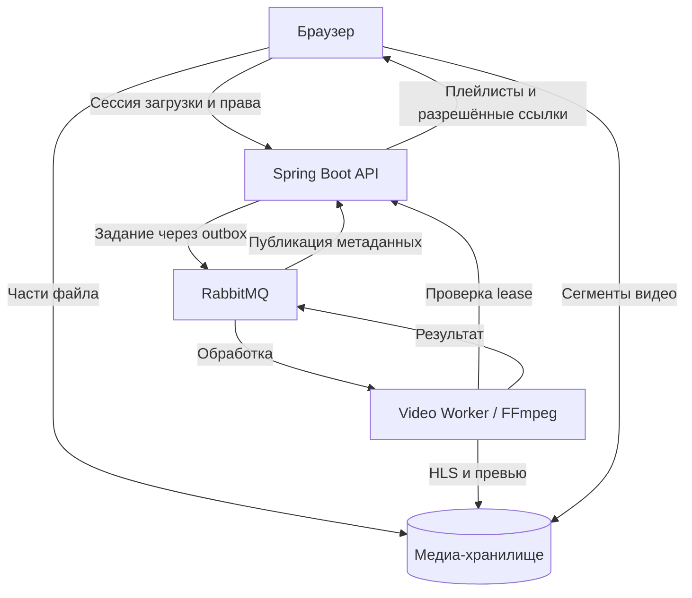

# Video Service

Проектирование сервиса загрузки, обработки и просмотра видео на Java / Spring Boot.

**Статус: частичная реализация MVP.** Регистрация/авторизация и контур загрузки исходного видео реализованы в API; worker, обработка, публикация и воспроизведение пока остаются проектом. Документы описывают целевое поведение MVP, а не целиком готовую систему. [Точное состояние реализации](docs/implementation-status.md).

| Архитектура | Данные | Контракты | Сценарии |
|---|---|---|---|
| [C4: три уровня](docs/architecture/overview.md) | [Доменная модель](docs/domain/model.md) | [HTTP API](docs/api/http.md) | [Загрузка](docs/scenarios/upload.md) |
| [Structurizr DSL](docs/architecture/workspace.dsl) | [ERD и ограничения](docs/domain/erd.md) | [OpenAPI YAML](docs/api/openapi.yaml) | [Обработка и сбои](docs/scenarios/processing.md) |
| [Решения и компромиссы](docs/decisions/0001-processing-and-playback.md) | [Состояния и инварианты](docs/domain/model.md#состояния) | [События](docs/api/events.md) | [Просмотр](docs/scenarios/playback.md) |
| [Границы MVP](docs/requirements.md) | [Индексы](docs/domain/erd.md#индексы-и-ограничения) | [AsyncAPI YAML](docs/api/asyncapi.yaml) | [Удаление](docs/scenarios/deletion.md) |

## Главный путь



## Что делает MVP

- Загружает файл частями напрямую в приватное S3-совместимое хранилище.
- Асинхронно создаёт HLS и превью; API владеет состоянием, worker обрабатывает файлы.
- Поддерживает PUBLIC, UNLISTED и PRIVATE, а также блокировку модератором.
- Восстанавливает задания после сбоя, отклоняет устаревшие результаты и удаляет лишние файлы.

[Начать чтение документации](docs/README.md) · [Правила API](docs/api/http.md) · [Что проверить при реализации](docs/review-checklist.md)

## Как просматривать

Mermaid-схемы находятся в Markdown. OpenAPI можно открыть в Swagger Editor или подключить к Swagger UI. Три C4-представления строятся из `docs/architecture/workspace.dsl` в Structurizr.

Для локального просмотра OpenAPI из корня репозитория:

```bash
docker run --rm -p 8082:8080 -e SWAGGER_JSON=/spec/openapi.yaml -v "${PWD}/docs/api:/spec:ro" swaggerapi/swagger-ui
```

PowerShell:

```powershell
docker run --rm -p 8082:8080 -e SWAGGER_JSON=/spec/openapi.yaml -v "${PWD}/docs/api:/spec:ro" swaggerapi/swagger-ui
```

Открыть `http://localhost:8082`. Кнопка Try it out потребует работающий backend; сам контракт можно читать без него.

## Проверка документации

```bash
python -m pip install -r scripts/requirements-docs.txt
python scripts/validate_docs.py
```

Проверка выполняет валидацию OpenAPI, ссылок, примеров и схем событий. Проверки реализации добавляются после появления backend.
