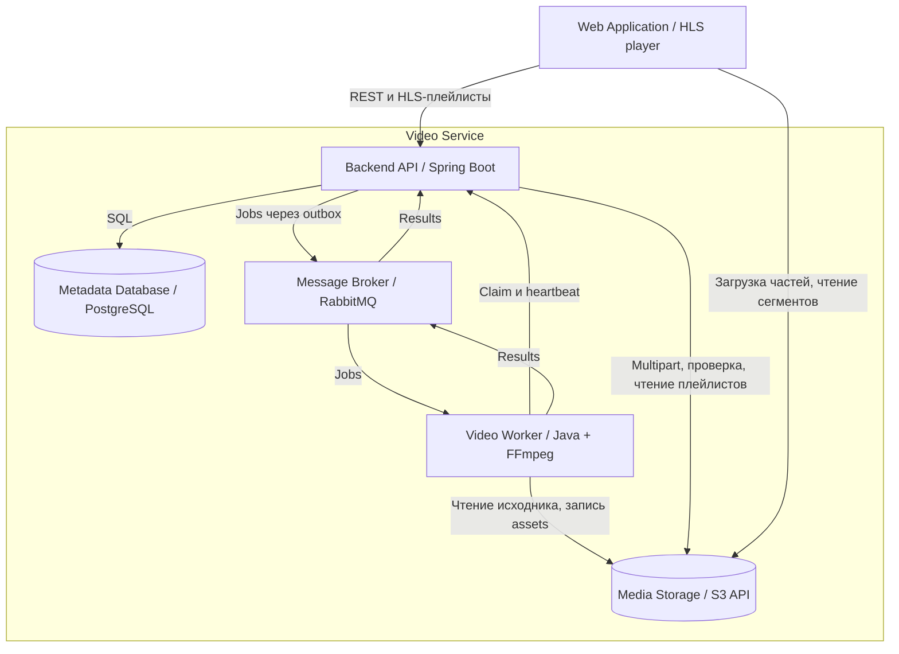
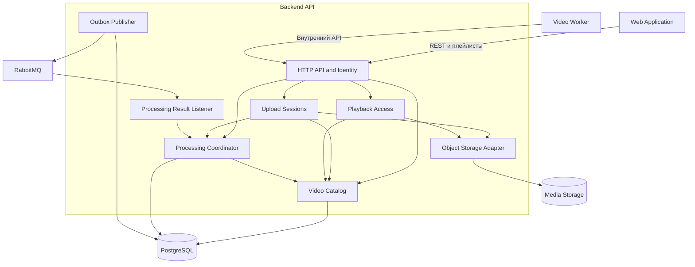

# Архитектура C4

[Исходная модель Structurizr](workspace.dsl) содержит C1, C2 и C3. Mermaid ниже — компактные представления для чтения прямо в репозитории.

## C1 — контекст

| Элемент | Роль | Связь с Video Service |
|---|---|---|
| Viewer | Зритель | Каталог и просмотр |
| Creator | Автор | Загрузка и управление своими видео |
| Moderator | Модератор | Блокировка и разблокировка |
| Video Service | Наша система | Загрузка, обработка, доступ и доставка |
| Email Provider | Планируемая внешняя система | Verification/recovery за границами текущего MVP |

## C2 — контейнеры

Web Application также является контейнером Video Service; на компактной схеме вынесен выше для читаемости. Полная граница отражена в DSL.

API владеет бизнес-данными. Worker не подключается к PostgreSQL. RabbitMQ содержит processing.jobs и processing.results; retry/DLQ — правила брокера, не отдельные микросервисы. PostgreSQL хранит outbox. Один publisher внутри API отправляет записи и отмечает подтверждённую доставку.

## C3 — Backend API

В полной DSL дополнительно показаны записи identity, upload и playback в БД. Компонент — функциональная часть приложения; каждый может включать контроллеры, сервисы и repositories.

## Владение данными

| Модуль | Таблицы | Публичный интерфейс |
|---|---|---|
| identity | users | authenticate, loadCurrentUser |
| catalog | videos, video_assets | metadata, permission checks, publishAssets, moderate |
| upload | upload_sessions | create, signPart, complete, abort |
| processing | processing_jobs, outbox_events, processed_events | enqueue, claim, heartbeat, applyResult, recover |
| playback | playback_sessions | createSession, renderManifest |
| deletion | deletion_tasks | requestDelete, sweep |
| shared HTTP infrastructure | idempotency_records | begin, replay, commitResponse |

Внутри одного API допустима общая транзакция нескольких модулей через их публичные интерфейсы. Таблицы и repositories одного модуля не используются напрямую другим модулем. Cleanup может быть scheduled-компонентом catalog/upload; отдельный процесс ему пока не нужен.

## Уточнение относительно первой C4

Добавлена связь Worker → API для lease/heartbeat. Playback Access теперь явно выдаёт плейлисты через API и подписывает все связанные ресурсы. Это конкретизация предложенной архитектуры, необходимая для корректных повторов и приватного HLS.
