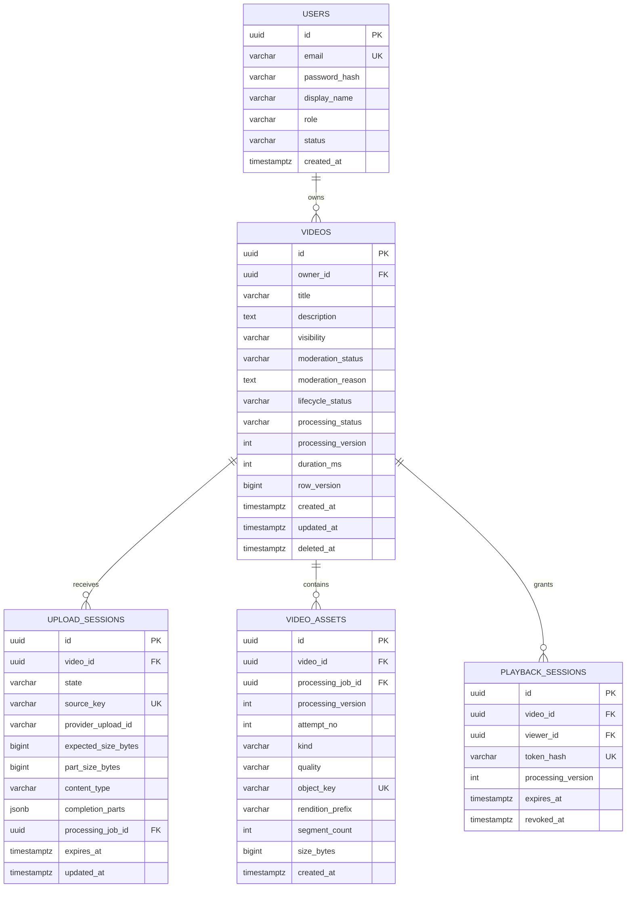
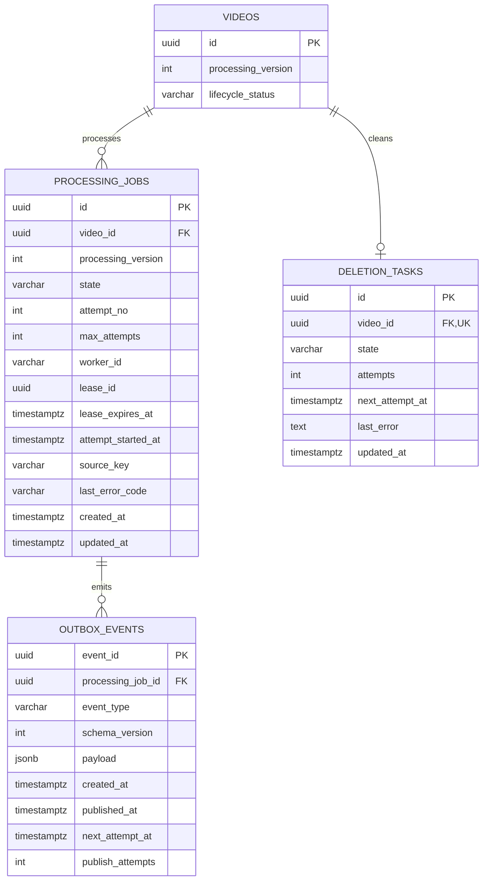

# ERD и модель хранения

PostgreSQL хранит метаданные; бинарные видео и сегменты находятся в объектном хранилище. Ниже две проекции одной схемы.

Реализованная часть схемы загрузки находится в миграции [`V2__upload_pipeline.sql`](../../app/src/main/resources/db/video/V2__upload_pipeline.sql). Диаграммы ниже показывают целевую схему всего MVP: таблицы воспроизведения и обработки результатов worker пока не реализованы. В миграции дополнительно есть технические поля `create_key`, `create_hash`, `completion_key` и `completion_hash` для безопасного восстановления запросов через внешнее S3-хранилище.

## Пользователи и видео

`viewer_id` nullable для PUBLIC/UNLISTED. FK viewer_id → users существует, но опущен из рисунка для читаемости. Поле quality nullable для исходника/master/thumbnail. По сегменту строка не создаётся: rendition хранит проверенный prefix, segmentCount и плейлист. Удаление охватывает весь серверный prefix видео, включая неизвестные незавершённые попытки.

## Обработка и служебные записи

Отдельно, без искусственных FK к бизнес-сущностям:

| Таблица | Ключ и поля | Назначение |
|---|---|---|
| processed_events | PK `(consumer_name, event_id)`, processed_at, disposition | Дедупликация. disposition: APPLIED, DUPLICATE, STALE, REJECTED |
| idempotency_records | PK `(user_id, operation, key)`, request_hash, state, response_status, response_body, response_headers, expires_at | Повтор ответа и защита от повторного создания; FK user_id → users |

Disposition DUPLICATE — иной eventId для уже завершённого job. Повтор того же eventId обнаруживается существующей строкой и не требует второй записи.

## Индексы и ограничения

| Таблица | Ограничение / индекс |
|---|---|
| users | UNIQUE canonical email: trim + lower; role IN USER/MODERATOR/ADMIN; status IN ACTIVE/BLOCKED |
| videos | FK owner_id; CHECK перечислений и processing_version >= 1; row_version >= 0 |
| videos | Partial index `(created_at DESC, id DESC)` WHERE visibility='PUBLIC' AND processing_status='READY' AND moderation_status='CLEAR' AND lifecycle_status='ACTIVE' |
| videos | `(owner_id, created_at DESC, id DESC)` для личного списка |
| upload_sessions | Partial UNIQUE(video_id) WHERE state IN INITIATING/OPEN/COMPLETING |
| upload_sessions | UNIQUE(source_key); expected_size_bytes > 0; `(state, expires_at)` для cleanup |
| processing_jobs | UNIQUE(video_id, processing_version); 0 <= attempt_no <= max_attempts; индекс `(state, lease_expires_at)` |
| processing_jobs | Composite UNIQUE(id, video_id, processing_version) для составного FK assets |
| video_assets | UNIQUE(object_key); FK `(processing_job_id, video_id, processing_version)` → jobs для результатов; SOURCE имеет nullable jobId |
| video_assets | Partial UNIQUE(video_id, processing_version, attempt_no, kind) WHERE kind IN MASTER_PLAYLIST/THUMBNAIL |
| video_assets | Partial UNIQUE(video_id, processing_version, attempt_no, quality) WHERE kind='MEDIA_PLAYLIST'; quality NOT NULL для MEDIA_PLAYLIST |
| outbox_events | Partial index `(next_attempt_at, created_at)` WHERE published_at IS NULL |
| playback_sessions | UNIQUE(token_hash); `(expires_at)` для очистки; viewer_id nullable |
| deletion_tasks | UNIQUE(video_id); `(state, next_attempt_at)` для повторов |
| processed_events | Composite PK; `(processed_at)` для retention |
| idempotency_records | Composite PK; `(expires_at)` для retention |

Точные DDL и миграции создаются при реализации. Межтабличные инварианты READY/lease нельзя полностью выразить CHECK: нужны транзакции и прикладные проверки.

## Транзакции

1. **Создание видео:** video + завершённый idempotency result.
2. **Complete upload:** после проверки S3 — source asset + завершённая сессия + job + QUEUED Video + outbox + idempotency result атомарно.
3. **Claim:** lock job и Video в стабильном порядке; ACTIVE/current version; increment attemptNo, leaseId, expiry; Video PROCESSING.
4. **Result:** lock Video/job; проверить текущую попытку и lease; зарегистрировать dedup + assets + READY/FAILED либо новый outbox атомарно.
5. **Delete:** lifecycle DELETING + cancelled job + revoke playback + deletion task атомарно.

S3, SQL и брокер не образуют одну транзакцию. INITIATING/COMPLETING, outbox и sweepers закрывают окна между ними. Worker не читает БД; его claims и heartbeats идут через внутренний HTTP API.

## Хранение и retention

Video DELETED сохраняется как tombstone для восстановления и отклонения поздних результатов. Техническая retention требует отдельного решения при внедрении; нельзя бездумно удалять dedup/job до окончания срока жизни сообщений. Refresh tokens и история отдельных попыток не входят в эту MVP-схему.
