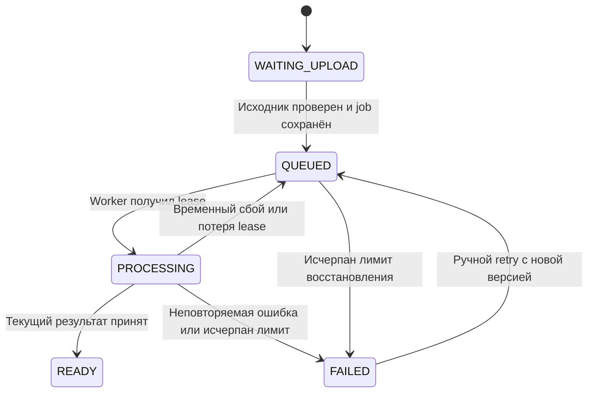

# Доменная модель

## Термины

| Понятие | Значение |
|---|---|
| Video | Метаданные и правила доступа; не файл в БД |
| UploadSession | Ограниченное во времени разрешение собрать один исходник |
| VideoAsset | Исходник, плейлист rendition, master playlist или thumbnail |
| ProcessingJob | Одна генерация обработки исходника |
| Attempt | Попытка одного job; номер растёт при новом claim |
| ProcessingVersion | Версия обработки видео; растёт при ручном retry |
| Lease | Временное право worker выполнять текущую попытку |
| PlaybackSession | Короткое разрешение запросить HLS-плейлисты |
| OutboxEvent | Событие, записанное с бизнес-изменением в одной транзакции |
| DeletionTask | Долговечная задача очистки файлов видео |

## Агрегаты и границы

- **Video** — корень агрегата метаданных. Принимает изменение названия, visibility, moderation и lifecycle; READY разрешается только вместе с проверенным набором assets.
- **UploadSession** — корень загрузки. Привязан к владельцу и Video. Multipart в S3 — внешний ресурс; согласованность восстанавливается проверкой и cleanup.
- **ProcessingJob** — корень обработки. Владеет attemptNo, lease и лимитом попыток. Автоматические повторы сохраняют processingVersion; ручной retry создаёт новый job и новую версию.
- **PlaybackSession** — отдельный короткоживущий агрегат. Содержит хеш случайного token; права перепроверяются при чтении каждого плейлиста.
- **DeletionTask** — отдельная восстановимая задача. Tombstone Video сохраняется и запрещает новую публикацию.

## Состояния

Состояния независимы. Например, READY + PRIVATE + CLEAR + ACTIVE означает готовое приватное видео.

| Ось | Значения | Смысл |
|---|---|---|
| processingStatus | WAITING_UPLOAD, QUEUED, PROCESSING, READY, FAILED | Техническая готовность |
| visibility | PUBLIC, UNLISTED, PRIVATE | Правило пользовательского доступа |
| moderationStatus | CLEAR, BLOCKED | Решение модератора |
| lifecycleStatus | ACTIVE, DELETING, DELETED | Удаление |

В WAITING_UPLOAD удаление/истечение загрузки не меняет processingStatus: lifecycle становится DELETING, затем DELETED. Для READY повторная обработка в MVP не предусмотрена.

UploadSession: `INITIATING → OPEN → COMPLETING → COMPLETED`; из незавершённого состояния возможны `ABORTED` и `EXPIRED`. COMPLETING может восстанавливаться по HEAD исходника. После 24 часов незавершённое видео удаляется через lifecycle.

ProcessingJob: `QUEUED → RUNNING → SUCCEEDED`; RUNNING может перейти в QUEUED или FAILED; QUEUED/RUNNING может стать CANCELLED при удалении. TERMINAL = SUCCEEDED, FAILED, CANCELLED.

DeletionTask: `PENDING → RUNNING → DONE`; при ошибке возвращается PENDING с backoff. Исчерпание автоматических попыток даёт FAILED и требует ручного восстановления. До успешной очистки Video остаётся DELETING.

## Инварианты

| ID | Правило |
|---|---|
| INV-01 | Только владелец создаёт UploadSession, меняет метаданные и удаляет видео |
| INV-02 | Для видео существует максимум одна незавершённая сессия загрузки |
| INV-03 | READY требует master playlist, хотя бы одну rendition и thumbnail; пути assets относятся к текущей принятой попытке |
| INV-04 | Для videoId + processingVersion существует один job |
| INV-05 | Одновременно действителен один lease job; claim и heartbeat сериализованы транзакцией |
| INV-06 | Результат принимается только для ACTIVE Video, текущего job/version/attempt и действующего lease |
| INV-07 | Один job имеет максимум один принятый терминальный результат; дубль с новым eventId не меняет его |
| INV-08 | Outbox создаётся в той же SQL-транзакции, что job или изменение для повторной отправки |
| INV-09 | Consumer подтверждает result только после commit либо фиксации осознанного игнорирования |
| INV-10 | DELETING/DELETED запрещает выдачу новых playback-сессий и плейлистов |
| INV-11 | Object key генерирует сервер; клиент не выбирает bucket/prefix и не передаёт произвольный URL для чтения worker |
| INV-12 | Idempotency-Key одного пользователя и операции не используется с другим fingerprint запроса |
| INV-13 | При blocking/смене visibility новые плейлисты используют актуальные права; старые signed URL ограничены TTL |

## Матрица доступа

| Действие | Анонимный | Пользователь | Владелец | MODERATOR / ADMIN |
|---|---|---|---|---|
| Каталог | PUBLIC + READY + CLEAR + ACTIVE | То же | То же; свои через /users/me/videos | То же; отдельный moderation API |
| Получить видео по id | PUBLIC/UNLISTED, READY, CLEAR, ACTIVE | То же | Любое своё состояние | Любое видео по id |
| Создать playback-сессию | PUBLIC/UNLISTED, READY, CLEAR, ACTIVE | То же | Также PRIVATE, если READY/CLEAR/ACTIVE | Приватный просмотр чужого не разрешён автоматически |
| Изменить / удалить / загрузить | Нет | Только свои | Да | Только свои; роль не даёт права менять чужие метаданные |
| BLOCKED | Не видно | Не видно | Метаданные видны, playback запрещён | Метаданные видны, playback запрещён |
| Модерация | Нет | Нет | Нет, если обычный USER | Да, требуется причина |

UNLISTED не попадает в общий каталог, но доступно любому, кто знает id/ссылку. PRIVATE в MVP доступно только владельцу; ACL для приглашённых пользователей — будущая функция.

Скрытый или отсутствующий ресурс возвращает 404, чтобы не раскрывать существование. Владелец, знающий своё видео, получает 409 при попытке playback до READY/после BLOCKED; для DELETED — 410. Пользовательская аутентификация и worker JWT — разные аудитории и полномочия.
