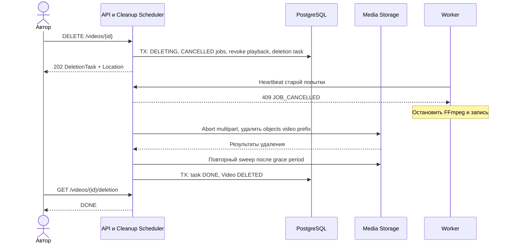

# SC-04. Удаление и поздний результат обработки

Автор удаляет своё видео; HTTP-запрос не ждёт удаления всех файлов. Video tombstone сохраняется.

Поздний RabbitMQ result проходит INV-06 и отвергается как STALE. Удаление не зависит от наличия всех rows assets: cleanup проверяет весь серверный prefix видео.

## Гонки и повторы

- Lock order Video → Job общий с result application. После commit DELETING никакой result не возвращает READY в доступное состояние.
- Повтор DELETE в DELETING возвращает ту же задачу и 202; после DELETED — 204.
- Первый sweep может пересечься с записью worker. Заключительный sweep проводится после остановки/истечения worker capability и grace period.
- Для настоящей изоляции worker получает scoped storage credentials на attempt prefix и ограниченный срок; если выбранное S3-хранилище не поддерживает scoped temporary credentials, это ограничение инфраструктуры надо явно решить до деплоя. Общий постоянный ключ worker не обеспечивает немедленного отзыва.
- Лимит попытки 20 минут. Предлагаемая grace period для финальной очистки — 30 минут от отмены: покрывает TTL storage capability до 20 минут и запас. Reconciliation периодически проверяет deleted prefixes повторно.
- Ошибка delete отдельных объектов не считается успехом всего удаления. Задача повторяется с backoff; HTTP не обещает мгновенную физическую очистку.
- DELETE для чужого/неизвестного id — 404. Tombstone позволяет владельцу проверить статус; публичному зрителю ресурс скрыт.
- Для storage с versioning одного delete недостаточно: lifecycle policy/cleanup должен учитывать object versions. В MVP versioning выключен либо явно настроена политика очистки.

## Проверки

Delete во время upload/complete/processing; двойной DELETE; старый result; частичный S3 delete; повторная запись после первого sweep; падение cleanup; восстановление FAILED task оператором.
