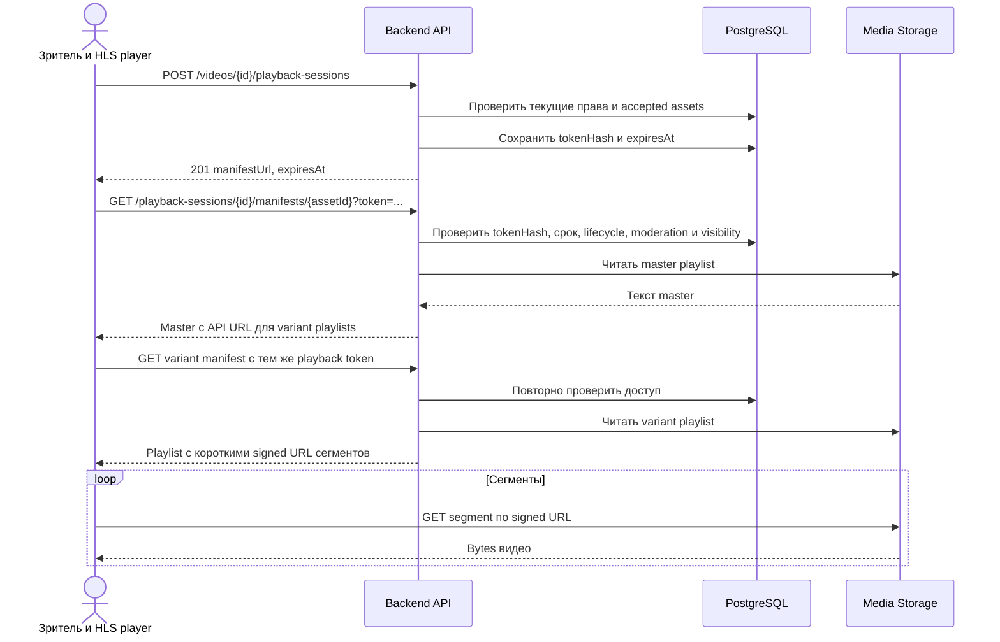

# SC-03. Просмотр публичного и приватного видео

Предусловия: READY, CLEAR, ACTIVE. PRIVATE требует JWT владельца. PUBLIC/UNLISTED допускают анонимного зрителя.

## Почему так

API передаёт небольшие текстовые плейлисты. Тяжёлые media bytes идут напрямую из storage. Bucket не public. Ссылка на один master playlist не защищает segment URLs сама по себе.

`PlaybackSession` выдаёт случайный 256-bit token, в БД хранится hash. token в URL нужен для HLS-клиентов, которым неудобно передавать Authorization на каждый manifest. URL нельзя логировать целиком; query token скрывается в access logs и telemetry. Ответы содержат `Cache-Control: no-store` и `Referrer-Policy: no-referrer`.

JWT применяется при создании PRIVATE-сессии. Потом короткий playback token является bearer capability; при каждом manifest API проверяет, что viewerId всё ещё владелец, аккаунт ACTIVE и текущее правило visibility допускает просмотр. Смена PUBLIC → PRIVATE отсекает анонимные/чужие сессии.

## Переписывание HLS

- Master ссылки на variant playlists заменяются на API manifest endpoints текущей сессии.
- Variant ссылки на segments, initialization maps и поддерживаемые URI-атрибуты заменяются на подписанные S3 URLs.
- Parser разрешает только объекты зарегистрированной текущей rendition и её проверенного prefix. Запрещены произвольные host, path traversal и ссылки за пределы assets.
- MVP не создаёт HLS encryption keys: AES/DRM не входят в контракт. Если неподдерживаемый URI-тег встречается, playlist не выдаётся как корректный.
- TTL сегмента = min(5 минут, оставшееся время playback-сессии).
- При 410 PLAYBACK_EXPIRED плеер создаёт новую сессию и сохраняет позицию воспроизведения.
- Сессия привязана к accepted processingVersion; смена версии делает старую сессию недействительной.

## Отказы и ограничения

Скрытый ресурс — 404. Владелец видит 409 VIDEO_NOT_READY/VIDEO_BLOCKED. Неверный playback token — 401; истёкший или отозванный — 410. Если новые права запрещают доступ, manifest endpoint возвращает 404. Сегмент, подписанный до блокировки, может оставаться доступным до TTL; уже скачанное видео отозвать нельзя.

## Проверки

Чужой PRIVATE; UNLISTED отсутствует в каталоге; token неверный/истёкший; подмена assetId; переход PUBLIC → PRIVATE; блокировка между master и variant; отсутствующий segment; все URI variant подписаны; секреты не попадают в logs.
