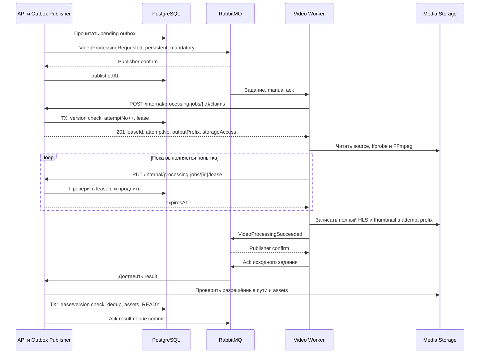
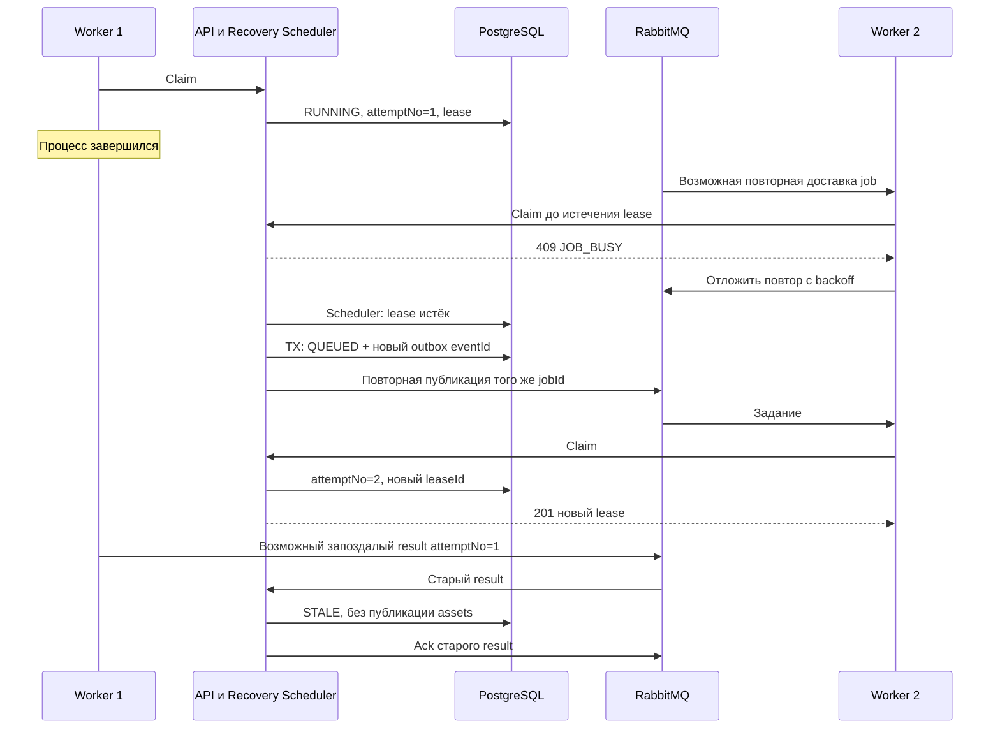

# SC-02. Обработка, повторы и потеря worker

Предусловие: job QUEUED, Video ACTIVE/current processingVersion, source asset проверен. Результат: READY с проверенными assets либо FAILED с публичным errorCode.

## Lease и версии

`processingVersion` меняется при ручном retry FAILED-видео. `attemptNo` меняется при claim внутри одного job. Lease привязан к job + attemptNo + случайному leaseId + worker identity.

API выдаёт lease на 60 секунд. Worker отправляет heartbeat раз в 20 секунд и продолжает до принятия result либо прекращения попытки. Heartbeat не продлевает абсолютный лимит 20 минут. Если heartbeat потерян или lease отклонён, worker останавливает FFmpeg и не публикует успешный результат этой попытки.

Полный outputPrefix генерирует API: `videos/{videoId}/processed/v{version}/{jobId}/attempt-{attemptNo}/`. Worker не выбирает путь чужого видео. Source key тоже берётся только из server-owned job.

## Worker умер

## Правила результата

- Сначала валидировать message schema и допустимые object keys. Проверить manifests, referenced segments и thumbnail до короткой SQL-транзакции. Не держать SQL-lock во время S3-запросов.
- В транзакции повторно проверить ACTIVE, jobId, processingVersion, attemptNo и действующий lease. Lock order: Video, затем Job.
- Повтор eventId: ack без повторного изменения. Иной eventId для уже завершённого job: записать DUPLICATE, не перезаписывать состояние.
- Устаревшая попытка/версия, истёкший lease или удаление: записать STALE, ack; файлы попадают в cleanup после grace period.
- Ошибка схемы: DLQ с sanitized причиной. Poison message не крутится бесконечно в requeue.
- Временная ошибка проверки S3/БД: bounded retry result; worker продолжает heartbeat до принятия результата либо абсолютного timeout. При истечении lease recovery запускает новую попытку.
- SUCCEEDED содержит полный inventory. Неполный результат не даёт READY.
- FAILED с retryable=true возвращает тот же job в QUEUED и создаёт outbox, если attemptNo < maxAttempts. Иначе job/video становятся FAILED.
- QUEUED job, не получивший claim за configured dispatch timeout, повторно публикуется scheduler. Это закрывает потерю доставки без бесконечного числа обработок: claim ограничивает actual attempts.

Подтверждение публикации RabbitMQ означает приём брокером, а не применение результата API. После result confirm worker ждёт состояния job через heartbeat: terminal ответ подтверждает применение; живой lease продлевается. Source message можно ack после подтверждённой публикации result; восстановление обеспечивается SQL job и scheduler.

## Проверки

Повтор outbox; падение до/после confirm; два claim одновременно; просроченный heartbeat; одинаковый/разный eventId; результат после удаления; timeout ffmpeg; recovery после terminal budget; отсутствующий сегмент.
