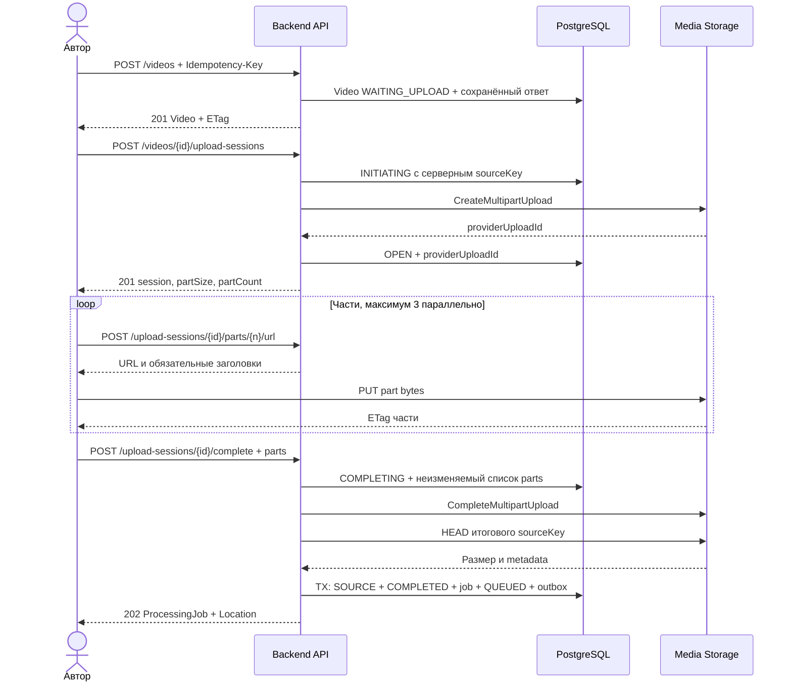

# SC-01. Загрузка и возобновление

**Участники:** автор, API, БД, хранилище. Предусловие: ACTIVE пользователь, JWT. Результат: исходник проверен; один job и outbox сохранены.

## Контракт

- Video создаётся отдельно, затем создаётся UploadSession. `videoId` во всех следующих шагах один и тот же.
- Размер части 16 MiB; partCount = ceil(sizeBytes / partSize). Для 2 GiB максимум 128 частей.
- Номера последовательные от 1 до partCount. Каждый ETag хранится клиентом с номером части; ETag не считается SHA/MD5 всего файла.
- Клиент получает provider-compatible `requiredHeaders` из API и отправляет их без изменения.
- Для multipart клиент запрашивает ровно предусмотренный размер каждой части. API при complete проверяет фактические части и итоговый размер; переданный contentType не доказывает формат видео.
- S3 CORS разрешает выбранный origin, PUT и требуемые заголовки, а ETag включён в Expose-Headers. Bucket остаётся private.
- `GET /upload-sessions/{id}` возвращает уже загруженные части для сравнения. Complete использует сохранённый клиентом список ETag; listing служит проверкой, а не молчаливой заменой списка клиента.

## Повтор и сбой

| Ситуация | Поведение |
|---|---|
| Обрыв PUT | Повторить нужную часть; тот же partNumber заменяет её |
| Истёк URL части | Получить новый URL в рамках OPEN-сессии |
| Повтор create с тем же ключом | Тот же video/session, без второго S3 upload |
| CreateMultipartUpload успешен, SQL не обновился | Sweep находит и abort orphan upload; INITIATING восстанавливается/завершается ошибкой |
| Complete S3 успешен, API упал до SQL commit | COMPLETING сохраняет parts; повтор проверяет HEAD sourceKey и завершает SQL-транзакцию |
| Complete с другим parts после фиксации COMPLETING | 409 REQUEST_CONFLICT; нельзя менять список во время сборки |
| Complete повторён после COMPLETED | Тот же job; повтор с другим ключом также не создаёт новый job |
| Финальная проверка размера не прошла | 422 SOURCE_MISMATCH; исходник не ставится в обработку, cleanup удаляет его |
| Сессия просрочена | 410 UPLOAD_EXPIRED; cleanup abort multipart и удаляет WAITING_UPLOAD Video через lifecycle |
| Файл имеет ложный MIME/неподдерживаемые потоки | Worker отклоняет после probe; Video FAILED |

Complete может вернуть 503, если внешний вызов не завершился за HTTP deadline. Состояние COMPLETING остаётся восстановимым. Клиент повторяет тот же запрос с тем же Idempotency-Key; 202 выдаётся только после commit job/outbox.

## Проверки

Повтор create/complete не создаёт дубликаты; upload после обрыва продолжает части; источники чужого пользователя недоступны; delete/complete гонка не запускает новый job для DELETING; корректно восстанавливается S3-success/SQL-failure.
